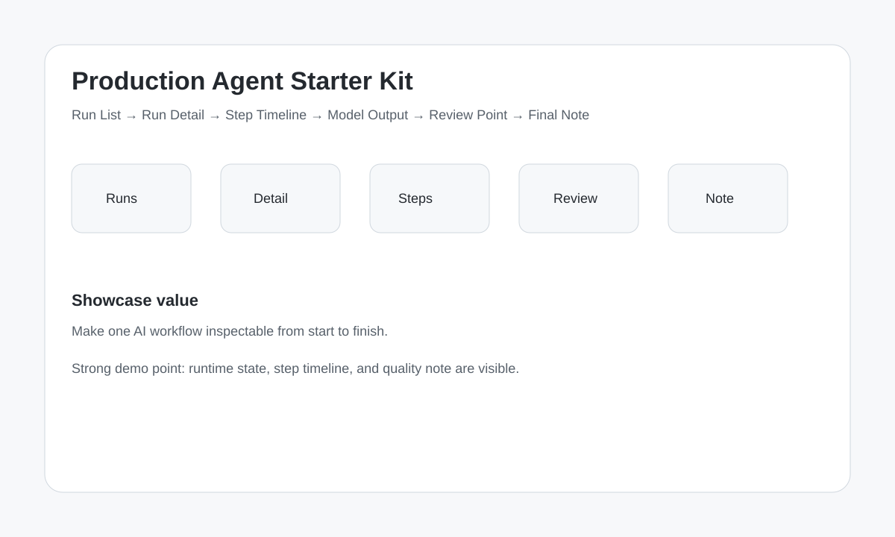

# Design Gallery

## Overview

## Demo intent

Use this visual as the first layout direction for the MVP demo.

The product should make runtime behavior visible through:

- run list
- run detail
- step timeline
- model output
- review point
- final note
